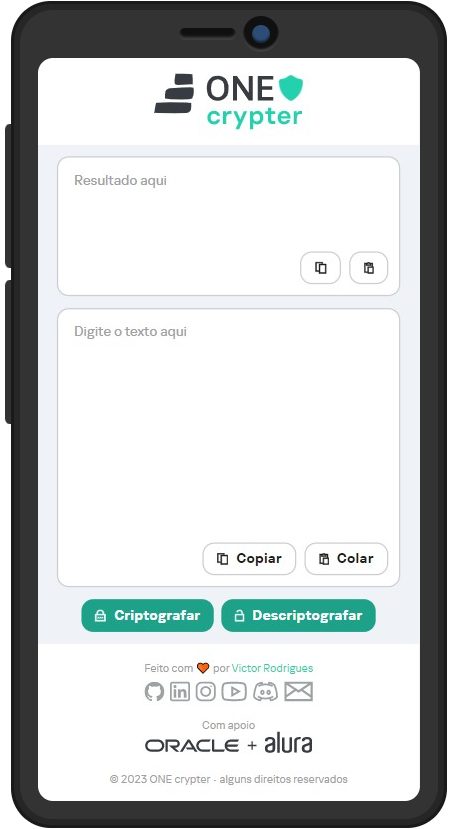

Look in: [English](/README_en.md) | Português

<h1> Quem sou... </h1>

Um curioso que sempre busca aprender, com sonhos à realizar e muitas metas para cumprir 🚀🚀, aqui estão alguns dos meus projetos:

 

 
  <b> 
    <a href="https://github.com/src-rodrigues/one-crypter" target="_blank">ONE crypter</a>
  </b>

Uma ferramenta que criptografa e descriptografa um texto qualquer, desenvolvida com tecnologias Web durante o programa estudos [ONE](https://www.oracle.com/br/one).

👈🽠<strong>Prévia</strong>

   
  

    
    
  

